# blockly-block-lexical-variables [](https://github.com/google/blockly)

# Table of Contents

- [Blocks](#blocks)
    - [Lexical/local variable declarations](#lexicallocal-variable-declarations)
    - [Global variable declaration](#global-variable-declaration)
- [Variable/Parameter setters and getters](#variableparameter-setters-and-getters)
    - [Setter](#setter)
    - [Getter](#getter)
- [Loops](#loops)
    - [For](#for)
- [Functions/procedures](#functionsprocedures)
    - [Function/procedure definition with no return value](#functionprocedure-definition-with-no-return-value)
    - [Function/procedure definition with a return value](#functionprocedure-definition-with-a-return-value)
    - [Function/procedure call with no value](#functionprocedure-call-with-no-value)
    - [Function/procedure call with value](#functionprocedure-call-with-value)
- [Notes](#notes)
- [Installation](#installation)
    - [Yarn](#yarn)
    - [npm](#npm)
- [Usage](#usage)
- [BYOB (Build Your Own Blocks)](#byob-build-your-own-blocks-aka-how-to-build-your-own-blocks-using-the-lexical-variable-fields)
- [Credits](#credits)
- [License](#license)

This plugin adds a set of [Blockly](https://www.npmjs.com/package/blockly) 
blocks and fields that support lexical (aka local) variables, as well as a dynamic UI
for obtaining variable and parameter getters and setters and for renaming variables.
It  also updates the UI for existing blocks that are implicitly lexically scoped,
i.e.:
* Function/Procedure definitions
* For loops

For variable getter and setter blocks this
plugin also provides dropdowns which allow the user to change the variable
name to any variable allowed by scope.  The plugin will also mark any variable blocks
that are moved out of their allowable scope.

The plugin also adds a dropdown for procedure call blocks, allowing the user to
change the call to be any other procedure of the same basic shape (i.e. statement
shape or expression shape).

This plugin is based on code originally written for 
[MIT App Inventor](https://appinventor.mit.edu).

You can see a demo version of a Blockly app that has integrated this plugin
[here](https://mit-cml.github.io/lexical-variable-demo/).  The code for that
demo is [here](https://github.com/mit-cml/lexical-variable-demo).

If you want to define your own blocks that use the fields defined by this plugin, see the 
[BYOB](#byob-build-your-own-blocks-aka-how-to-build-your-own-blocks-using-the-lexical-variable-fields) section
## Blocks
### Lexical/local variable declarations
**Block type: 'local-declaration-statement'** - The variable name will be scoped to be valid
within the body of the block.

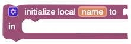

While hovering over the variable name:

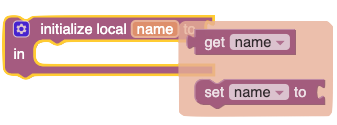

### Global variable declaration
**Block type: 'global-declaration-statement'** - An block which declares a global variable. The
variable name is scoped to the entire program.


and while hovering over the variable name:

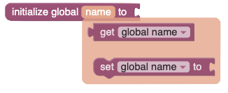

## Variable/Parameter setters and getters
### Setter
**Block type: 'lexical_variable_set'** - Note that despite the block type name, the 
same block is used for global variables, local variables, loop variables and 
function/procedure parameters.  The names that appear in the dropdown will change
according to the placement of the block.  I.e., it will show the variables that are
in scope for that getter according to which blocks it is within.


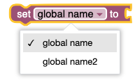
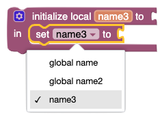

###Getter
**Block type: 'lexical_variable_get'** - Exactly analogous to the setter block.


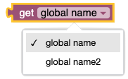
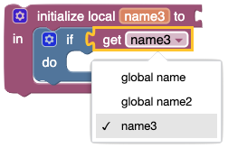

## Loops
### For
**Block type: 'controls_for'** - A block which enables a `for` loop

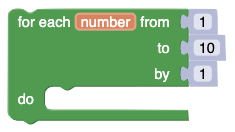
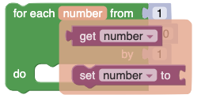

**Block type: 'controls_forEach'** - A block which enables a loop over the items in a list

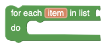
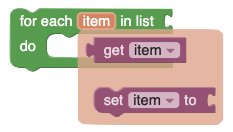

## Functions/procedures
### Function/procedure definition with no return value.
**Block type: 'procedures_defnoreturn'**

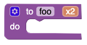

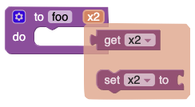

### Function/procedure definition with a return value.
**Block type: 'procedures_defreturn'**

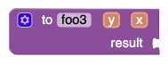

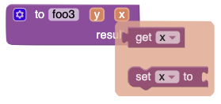

### Function/procedure call with no value
**Block type: 'procedures_callnoreturn'** - Note that, though I don't show it here, the
procedure name field is a dropdown which allows the user to select any procedure and 
the block will change to match that procedures name and parameters.

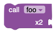
or


### Function/procedure call with value
**Block type: 'procedures_callreturn'** - This has the same dropdown behavior as the previous procedure
call block.

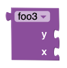
or
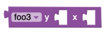

## Notes
Right now the new fields and the new (or redefined) blocks are somewhat
co-dependent.  At some point they will be disentangled.  At that point
this plugin might split into two; one for the fields and one for the blocks,
with the latter plugin dependent on the first.  At that point you will
also be able to build you own blocks using the fields.

## Installation

### Yarn
```
yarn add @mit-app-inventor/blockly-block-lexical-variables
```

### npm
```
npm install @mit-app-inventor/blockly-block-lexical-variables --save
```

## Usage
_Please make sure that your app which includes this plugin uses a relatively recent version of Blockly.  As of this
writing that would be version 10.0.0._

You'll want to include something like the following in your app:

```js
import * as Blockly from 'blockly';
import {LexicalVariablesPlugin} from '@mit-app-inventor/blockly-block-lexical-variables';
...
const workspace = Blockly.inject(...);
...
// Load lexical variable plugin
LexicalVariablesPlugin.init(workspace);
```
Note that unlike with standard Blockly, you should **not** use a custom toolbox category
for your variables, as this would interfere with the way that variables are declared and
used with this plugin.  Just create an ordinary Variables category, if you want, and
place the lexical-variable-get and lexical-variable-set blocks in there.

## BYOB (Build Your Own Blocks), aka, how to build your own blocks using the lexical variable fields
The lexical variable fields are designed to be used in blocks that contain a set of methods that the lexical variable
implementation will call. In the general case, you would need to define all of these methods (see 
[FIELDS.md](FIELDS.md) for details).  However, if you are building a block that that doesn't have a mutation UI that needs 
to be kept
in sync with the fields, then the situation is a bit simpler.  In that case, you can use the `lexicalVariableScopeMixin`
defined in [mixins.js](src/mixins.js).  If you use that mixin you only need to define these two methods for your block:

* `getDeclaredVarFieldNames()`: a list of the names of the fields of the block's declared variables (e.g. "VARS").
* `getScopedInputName()`: The name of the input that defines the block's scope (e.g., "DO")

The mixin will then take care of the rest (i.e. define the rest of the methods that the block needs).  You add the mixin
to your block like this by calling `this.mixin(lexicalVariableScopeMixin);` in the block's `init()` method.
You can see examples of how to use it in [lexical-variables.js](src/blocks/lexical-variables.js) for the 
`simple_local_declaration_statement` block 
and in [controls.js](src/blocks/controls.js) for the`controls_forEach` and `controls_forRange` blocks.

The `core` module
exports the `lexicalVariableScopeMixin` as a field on the exported static `LexicalVariablesPlugin` class.

NOTE: If you are creating your own blocks and do not want to use the blocks defined in this plugin, you should import
just the `core` module from this plugin, i.e. 
```js
import {LexicalVariablesPlugin} from '@mit-app-inventor/blockly-block-lexical-variables/core';
```
Here's snippet of what the code might look like to implement a `simple_local_declaration_statement` block, if 
you didn't want to use the blocks already defined in this plugin:
```js
import * as Blockly from 'blockly/core';
import * as libraryBlocks from 'blockly/blocks';
import * as En from 'blockly/msg/en';
import {javascriptGenerator} from 'blockly/javascript';
import {LexicalVariablesPlugin} from '@mit-app-inventor/blockly-block-lexical-variables/core';

Blockly.setLocale(En);
const workspace = Blockly.inject(...);
LexicalVariablesPlugin.init(workspace);

const FieldParameterFlydown =  LexicalVariablesPlugin.FieldParameterFlydown;
const lexicalVariableScopeMixin =  LexicalVariablesPlugin.lexicalVariableScopeMixin;

Blockly.Blocks['simple_local_declaration_statement'] = {
    category: 'Variables',
    helpUrl: "help",
    init: function () {
        // Let the theme determine the color.
        this.setStyle('variable_blocks');
        const declInput = this.appendValueInput('DECL');
        declInput.appendField(
            'let')
            .appendField(new FieldParameterFlydown('name', true), 'VAR')
            .appendField('to')
            .setAlign(Blockly.inputs.Align.RIGHT);
        this.appendStatementInput('DO')
            .appendField('in');
        this.setPreviousStatement(true);
        this.setNextStatement(true);
        this.setTooltip('tooltip');
        this.mixin(lexicalVariableScopeMixin);
    },
    getDeclaredVarFieldNames: function () {
        return ['VAR'];
    },
    getScopedInputName: function () {
        return 'DO';
    },
}

javascriptGenerator.forBlock['simple_local_declaration_statement'] = function (block, generator) {
    let code = '{\n  let ';
    code += (Shared.usePrefixInCode ? 'local_' : '') +
        block.getFieldValue('VAR');
    code += ' = ' + (generator.valueToCode(block,
        'DECL', Order.NONE) || '0');
    code += ';\n';
    code += generator.statementToCode(block, 'DO');
    code += '}\n';
    return code;
}
```
## Credits
As mentioned earlier, this plugin is based on code written for
[MIT App Inventor](https://github.com/mit-cml/appinventor-sources). The lexical 
variable implementation (and supporting blocks and UI) in App Inventor was
developed primarily by **Lyn Turbak** but has had many contributors over the years
including (in roughly chronological order):
* Sharon Perl
* Andrew McKinney
* Hal Abelson
* PMW
* Ralph Morelli
* Jeffry Schiller
* Jose Flores
* Joanie Weaver
* Shirley Lu
* mphox
* Leo Burd
* Dave Wolber
* Harry Davis
* WeiHua Li
* jbensal
* Shruti Rijhwani
* Liz Looney
* Evan Patton
* Susan Lane
* Colin Yang
* Beka Westberg
* Siddharth
* Mark Friedman

If you contributed to this code at some point and I somehow neglected to 
mention you, I apologise.  Let me know, file a bug or just submit a pull request
on this file.
## License
Apache 2.0
