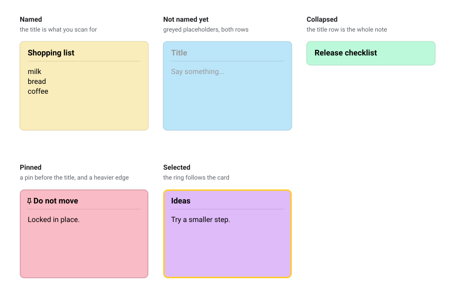

# 📝 Workspace Notes — Design Document

**Product:** Sticky notes for a Blockly workspace
**Status:** Built and working
**Last updated:** 7 September 2026

---

## 1. 🎯 The problem

A Blockly workspace is full of blocks, and blocks only say what the program
does. They cannot say _why_.

People need somewhere to put the human part: a reminder, a question for a
teammate, a warning about a tricky bit, a to-do list for later. Today there is
nowhere good to put that.

**Workspace Notes** adds sticky notes you can place anywhere on the canvas.

The single most important requirement: **a note must survive a save and
reload.** A note that disappears when you close the tab is worse than useless,
because people will trust it and then lose work.

---

## 2. 👤 Who it is for

| Person            | What they need                          | How notes help                                       |
| ----------------- | --------------------------------------- | ---------------------------------------------------- |
| 🎓 **A teacher**  | Leave instructions on a starter project | Pin a bright note at the top with the task           |
| 🧑‍🎓 **A student**  | Remember what they were doing           | Drop a note next to the half-finished part           |
| 👥 **A team**     | Explain a decision to each other        | A titled, colour-coded note beside the tricky blocks |
| 🧑‍💻 **A reviewer** | Flag things without changing code       | A red-ish note saying "this loop looks wrong"        |

---

## 3. ✅ Goals and 🚫 Non-goals

### Goals

- ✅ Notes save and load with the workspace, every time, losing nothing.
- ✅ Notes feel like part of Blockly, not something bolted on.
- ✅ Notes are quick to create and quick to get out of the way.
- ✅ A note can be told apart at a glance — by colour and by title.
- ✅ Everything is undoable. Nothing is lost by accident.
- ✅ Old files that had plain comments still open, and keep working.

### Non-goals

- 🚫 **Rich text.** No bold, links, or images inside a note. Plain text only.
- 🚫 **Comment threads.** A note is not a discussion. No replies, no mentions.
- 🚫 **Live collaboration.** Two people editing the same note at once is out of
  scope.
- 🚫 **Notes tied to a block.** A note lives on the canvas, not attached to a
  block that might move or be deleted.
- 🚫 **Notes fixed to the screen.** A note lives on the canvas and scrolls with
  it. See the decision in section 9.

---

## 4. 🧭 Scope: what is new, and what we get for free

Blockly already has "workspace comments" — a plain box you can type into. It
turns out they already do a lot.

| Capability                                        | Already in Blockly | New in this design |
| ------------------------------------------------- | ------------------ | ------------------ |
| A box on the canvas you can type into             | ✅                 |                    |
| Drag to move                                      | ✅                 |                    |
| Drag a corner to resize                           | ✅                 |                    |
| Collapse and expand                               | ✅                 |                    |
| Delete                                            | ✅                 |                    |
| Copy, paste, duplicate                            | ✅                 |                    |
| Keyboard navigation and screen-reader labels      | ✅                 |                    |
| Undo and redo                                     | ✅                 |                    |
| A **title**                                       |                    | ✨ New             |
| A **colour** per note                             |                    | ✨ New             |
| **Pinning** — lock a note in place                |                    | ✨ New             |
| **Stacking order** — bring to front, send to back |                    | ✨ New             |
| **Author and dates** recorded automatically       |                    | ✨ New             |
| A **versioned save format** for all of the above  |                    | ✨ New             |

> 💡 **The design decision behind this table:** we build _on top of_ Blockly's
> comment rather than replacing it. Everything in the left column keeps working
> exactly as people already expect, and the new work is only the right column.

---

## 5. 🖼️ What a note looks like

### The parts of a note


A note is one sheet of paper:

- **The title row** — a heading printed on the paper itself, set a size above
  the body and in bold, because a heading at body size is not a heading. No
  strip, no buttons; the title is the only thing there.
- **A hairline rule** under it, dividing the heading from the body.
- **The body** — the text, written straight onto the paper. No box around it.

### The states a note can be in



The top-left one is a plain Blockly comment, shown for comparison. Square
corners, a darker header strip, text in a bordered box. Both halves of that are
block grammar: a rectangle with a strip across the top is a block's silhouette,
and a lighter bordered box inset into a coloured body is how a field on a block
is drawn. A note drops both — a rounded card, a heading, a rule, and the text on
the paper.

### Visual rules

| Rule                            | Why                                                                                                               |
| ------------------------------- | ----------------------------------------------------------------------------------------------------------------- |
| 📐 Even spacing on every side   | Uneven gaps look accidental. Every margin around an icon or the text is the same.                                 |
| 🎨 Edge colour follows the fill | Each colour gets a matching, slightly deeper edge, so notes look like a set rather than seven unrelated stickers. |
| 🔤 Title always readable        | The title is dark, bold and a size larger than the body on every colour in the palette.                           |
| 🤫 No buttons at all            | Every action is in the context menu, so nothing sits on the paper but the words on it.                            |
| ✂️ Long titles shorten          | A title too long for the note is cut with an ellipsis, and re-cut live while the note is resized.                 |

---

## 6. ✨ The features

### 6.1 Create a note

Right-click anywhere on empty canvas and choose **Add Comment**. The note
appears where you clicked, ready to type in.

### 6.2 Write in it

Click the body and type. An empty note shows faded placeholder text so it never
looks broken. Text is saved as you go.

### 6.3 Move and resize

Drag the note by its title row to move it. Drag the bottom-right corner to
resize; the title re-shortens as you go, so it never runs off the paper. The
drag stops at a floor of one title row, one line of body and the margin under
it, so a note can always be seen and grabbed — dragging one down to nothing
would leave a note that is still on the workspace and still saved, findable
only by undo.

### 6.4 Give it a title 🏷️

Click the title and type — the same as clicking into the body below it.
Nothing opens and nothing moves; the heading just gains a caret. Enter commits,
Escape puts the old title back, and clicking elsewhere commits. A note that has
not been named shows a greyed `Title`, which stays put while you type over it.

Dragging a note by its title still drags it — the editor only opens if the
press stayed put, which is the same test Blockly uses to tell a field click
from a drag.

The title is the thing you read when you are scanning a busy workspace, so it
stays visible even when the note is collapsed down to a single strip.

### 6.5 Colour it 🎨

Right-click the note and pick from a row of seven colours: yellow, orange,
pink, purple, blue, green, grey.

The swatches sit in a single row inside the menu rather than as seven separate
menu entries, so choosing a colour is one click and the menu stays short. The
current colour is ringed so you can see what the note is now.

Colours are pale on purpose. A note has to be readable, and it must not shout
louder than the blocks around it.

### 6.6 Pin it 📌

Right-click → **Pin note**. A pinned note:

- 🔒 **Cannot be dragged.** It stays exactly where you put it.
- ⬆️ **Sits in front** of other notes.
- ✏️ **Draws a heavier edge**, so you can see why it will not move.

Right-click → **Unpin note** to release it. This is for the note that must not
be nudged out of the way — a teacher's instructions, a warning at the top of a
file.

### 6.7 Order them 🔼

Right-click → **Bring to front** or **Send to back**. Useful when notes overlap.
The order is remembered when you save.

### 6.8 Collapse it 🔽

Right-click → **Collapse note** to fold a note down to just its title row. The
title stays visible. Right-click → **Expand note** to open it again.

This is how you keep a long note around without it covering your blocks.

### 6.9 Duplicate it 📋

Right-click → **Duplicate note**, or copy and paste. The copy keeps the title, the
colour, and the pinned state, and lands slightly offset so it does not hide the
original.

### 6.10 Delete it, and undo 🗑️ ↩️

Right-click → **Delete note**, or press Delete while it is selected.

**One press of undo brings the note back complete** — same text, same title,
same colour, same pinned state. Not a blank note that you then have to
re-decorate. This mattered enough to design for specifically.

Every change is undoable: typing, resizing, recolouring, renaming, pinning,
reordering.

---

## 7. 💾 What gets remembered

This is the headline feature, so it is worth being explicit about it.

When a workspace is saved, every note is saved alongside the blocks. Nothing
extra to do, nothing separate to call.

| Remembered                            | Notes                                               |
| ------------------------------------- | --------------------------------------------------- |
| 📍 Position on the canvas             | Exact, including right-to-left layouts              |
| 📏 Width and height                   | Exactly as the user left it                         |
| 📝 The text                           |                                                     |
| 🏷️ The title                          | Only if it has one                                  |
| 🎨 The colour                         | Only if it is not the default                       |
| 📌 Pinned or not                      |                                                     |
| 🔼 Stacking order                     | So overlapping notes come back in the same order    |
| 🔽 Collapsed or expanded              |                                                     |
| 👤 Author                             | Whoever created it, if the host app supplies a name |
| 🕐 Created date and last-changed date | Set automatically                                   |

A saved note looks like this:

    {
      "id": "n1qX",
      "x": 40, "y": 20,
      "width": 240, "height": 140,
      "text": "Refactor this loop",
      "title": "TODO",
      "colour": "#ffd6a5",
      "meta": {
        "author": "ada",
        "createdAt": "2026-09-07T16:07:09Z",
        "updatedAt": "2026-09-07T16:09:41Z"
      }
    }

### Three rules about the format

**📦 Only write what is different.** A plain yellow note with no title records
no colour and no title. Files stay small, and a change to one note shows up as
a small, readable difference rather than a wall of text.

**🔢 Always record a version number.** The saved data carries a version. If the
format ever gains a field or changes shape, files saved today can still be
opened tomorrow — they are quietly upgraded as they load. This costs almost
nothing now and avoids a painful migration later.

**🕰️ Old files still open.** Workspaces saved before this feature existed, with
plain Blockly comments in them, load correctly. Each old comment becomes a note
with default colour and no title. Nothing is lost, and nothing needs converting
by hand.

---

## 8. 🔄 Behaviour rules

These are the small decisions that make the feature feel finished.

| Situation                                    | What happens                                                                                                                                          |
| -------------------------------------------- | ----------------------------------------------------------------------------------------------------------------------------------------------------- |
| A note is saved and the file is loaded twice | You get the same notes back. Never duplicates.                                                                                                        |
| A note is pinned, then you try to drag it    | Nothing moves. The heavier edge explains why.                                                                                                         |
| A note is pinned, then unpinned              | It becomes draggable again.                                                                                                                           |
| A title is longer than the note is wide      | It is shortened with an ellipsis, live, as the note is resized.                                                                                       |
| The writing is longer than the note is tall  | The body scrolls. The bar is thin, trackless and in the paper's own edge colour, painted only while the pointer is on the note or the caret is in it. |
| A note is resized down as far as it will go  | It stops at its minimum, still readable and still grabbable. It cannot be hidden.                                                                     |
| A note is collapsed and has a title          | The title shows.                                                                                                                                      |
| A note is collapsed and has no title         | The greyed `Title` placeholder shows, as it does when expanded.                                                                                       |
| A note is deleted and undone                 | It returns complete, in one undo.                                                                                                                     |
| A note is duplicated                         | The copy keeps everything and is offset so both are visible.                                                                                          |
| The workspace is read-only                   | Notes can be read and moved through, but not edited.                                                                                                  |
| A file is loaded                             | Loading does not fill up the undo history. Undo still means "undo what _I_ did".                                                                      |

---

## 9. ⚖️ Design decisions

### Why extend Blockly's comment instead of building a new object

Blockly's comment already handles dragging, resizing, keyboard access, screen
readers, copy and paste, and undo. Rebuilding all of that would have been a
large amount of work whose only outcome is re-creating bugs that are already
fixed.

**Trade-off:** the design is tied to how Blockly's comments behave. If Blockly
changes them, this feature has to follow.

### Why "pinned" means locked, not fixed to the screen

"Pinned" could mean two things:

1. 🔒 **Locked in place** — it stays where you put it on the canvas.
2. 📌 **Fixed to the screen** — it never scrolls away, like a heads-up display.

We chose **locked in place**. The screen-fixed version fights the way a
workspace scrolls and zooms, and a note that floats over your blocks wherever
you pan is more annoying than helpful.

**Open question:** if the screen-fixed behaviour turns out to be what teachers
actually want for instructions, that is a change of behaviour rather than a
bug, and worth revisiting.

### Why the title is edited in place rather than in a dialog

An earlier version asked for the title in a dialog, which was the wrong
instinct twice over: Blockly never asks for text in a dialog, and the fallback
`window.prompt` is a serif system box that matches nothing else on the page.
Clicking the title and typing is what a field on a block already does, so it is
the behaviour people arrive with.

Replacing it with Blockly's field editor was only half the fix, though, because
a field editor is built to be seen — a white box with the text selected. On a
note that still read as a mode opening on the paper. The editor is now
invisible: same position, same font, same placeholder, no box, no selection.
The rule is that the title should behave exactly like the body, and the body
has never needed anything to open.

**Trade-off:** a click on the title now does two things depending on whether it
moved. Blockly's own gesture code draws that line at the drag radius, and this
follows it, so dragging a note by its title still works.

### Why a note has no buttons

Every earlier round put icons in the top bar — collapse, delete, pin — and every
round the note read as a block, because a strip of icons across the top of a
rectangle is exactly what a block looks like. Moving all of it into the context
menu leaves nothing on the paper but the words on it, and the menu is where
people look for actions on a right-clickable object anyway.

**Trade-off:** collapsing and pinning are one click further away, and slightly
less discoverable. Pinning was already menu-only; collapsing is the real cost.

### Why notes get their own place in the save file

Notes are saved separately from Blockly's plain comments rather than pretending
to be them. This keeps the extra information clean and versioned, and means a
note is never saved twice by accident.

**Trade-off:** a file saved with notes is not a plain Blockly file. Anything
reading it needs to know about notes — though a plain Blockly editor would
simply ignore them rather than break.

### Why colours are pale

Notes sit among coloured blocks. A saturated note would compete with them and
make the workspace harder to read. Pale fills with a slightly deeper edge read
as "paper on a desk" rather than "another block".

Colour alone was not enough, though — several rounds of tuning hue, icon colour
and text colour all failed, because what reads as a block is the shape. The
palette was pulled paler again once the shape was fixed, so the two work
together: S 0.25 at V 0.98, against a block's S 0.45 at V 0.65.

---

## 10. 🗂️ How the code is laid out

Each folder is one layer, and a file is named for the single thing it holds.
Reading top to bottom is roughly reading the plugin's dependency order.

```
src/
├── index.ts               The whole public surface. Re-exports only, no logic.
├── plugin.ts              WorkspaceNotes: what a host constructs.
├── model/                 What a note is. note_mixin applies to both classes.
├── serialization/         JSON in and out, plus xml/ for the older format.
├── events/                The undo event a note fires.
├── clipboard/             Pasting a note with its title and colour intact.
├── ui/                    Chrome the user touches: menu, title editor, CSS.
├── utils/                 Pure helpers. No registration, no module state.
├── constants/             Numbers and names, grouped by what they configure.
└── types/                 The shapes that travel between the layers.
```

Four rules keep it that way:

- **`index.ts` holds no logic.** Anything it does not re-export is internal and
  free to move. It is also the build entry point, resolved by path, so it stays
  where it is.
- **No barrel files inside the folders.** Every import names the file it wants
  (`../constants/layout`, never `../constants`). Longer to type, and the reason
  the import graph stays legible as the code grows.
- **`utils/` is inert.** Pure functions, no Blockly registration, no
  module-level state — importable from a test with nothing set up.
- **Registration lives in `registry.ts`.** Anything that mutates a global
  Blockly registry does it in a file named `registry.ts` (or `xml/patch.ts`),
  so the side effects are findable in one sweep and every one of them has a
  matching `unregister`.

One import cycle exists on purpose: `model/note.ts` and `model/stacking.ts`
need each other, since a note restacks its neighbours when its z-index changes
and restacking needs the class to recognise a note. Both uses sit inside
function bodies, so neither runs while the modules are still evaluating.

---

## 11. 🚧 Limits and future work

### Known limits

- 📄 **Plain text only.** No formatting, links or images in a note.
- 🎨 **Seven colours.** No custom colour picker.
- 🔍 **Not searchable.** There is no way to find a note by its text yet.
- 🔗 **Not attached to blocks.** A note near a block is only near it by
  position. Move the block and the note stays put.

### Ideas worth considering next

| Idea                            | Why it might matter                                         |
| ------------------------------- | ----------------------------------------------------------- |
| 🔍 **Search notes**             | Once a workspace has twenty notes, finding one is hard.     |
| 🔗 **Attach a note to a block** | The most-requested thing this design deliberately left out. |
| ✅ **Checklists**               | Teachers writing task lists would use them immediately.     |
| 🏷️ **Colour meanings**          | Let a project define "red = bug, green = done".             |
| 👤 **Show the author**          | The name is already recorded but never displayed.           |

---

## 12. ❓ Open questions

1. Should pinned notes stay fixed on screen instead of on the canvas?
   (See section 9.)
2. Should the author's name be visible on the note, or stay hidden data?
3. Are seven colours enough, or is a custom colour needed?
4. Should a note be able to point at a block, without being owned by it?
