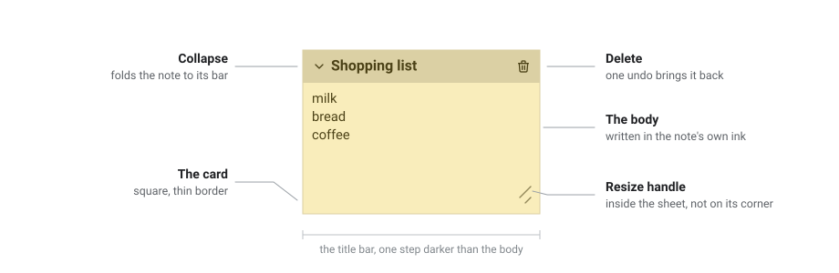

# Workspace Notes

[](https://github.com/google/blockly)

Sticky notes for a Blockly workspace: draggable, resizable, colour-coded cards
with a title, an author and a stacking order.

<p align="center">
  
</p>

Notes extend Blockly's own workspace comments, so dragging, resizing,
selection, keyboard navigation and undo all work exactly as they already do.
They are saved alongside your blocks, and round-trip through both JSON and XML.

## Install

```bash
npm install @mit-app-inventor/blockly-workspace-notes
```

Needs Blockly 13.2.1 or newer as a peer dependency, and Node 20+ to build.

## Use

```js
import * as Blockly from 'blockly';
import {WorkspaceNotes} from '@mit-app-inventor/blockly-workspace-notes';

const workspace = Blockly.inject('blocklyDiv', {toolbox});
new WorkspaceNotes(workspace).init();
```

That is the whole setup. Right-click the workspace to add a note; click a
note's title to rename it; right-click a note to recolour, pin, collapse or
restack it.

> **Import the plugin before `Blockly.inject`.** Blockly's stylesheets only
> reach workspaces injected after they are registered.

## Documentation

- [Getting started](./docs/getting-started.md) — install, setup and options
- [Using notes](./docs/using-notes.md) — everything you can do with a note
- [API](./docs/api.md) — the exported classes and functions
- [Saving and loading](./docs/saving.md) — the save format, JSON and XML
- [Design](./docs/design.md) — why it works this way, and how the source is
  laid out

## Develop

```bash
git clone https://github.com/mit-cml/blockly-plugins.git
cd blockly-plugins/blockly-workspace-notes
npm install
npm start
```

`npm start` opens the playground. Other scripts:

```bash
npm test               # typecheck, then the mocha suites
npm run build          # bundle and .d.ts into dist/
npm run lint           # ESLint
npm run format         # Prettier
```

## License

Apache-2.0
